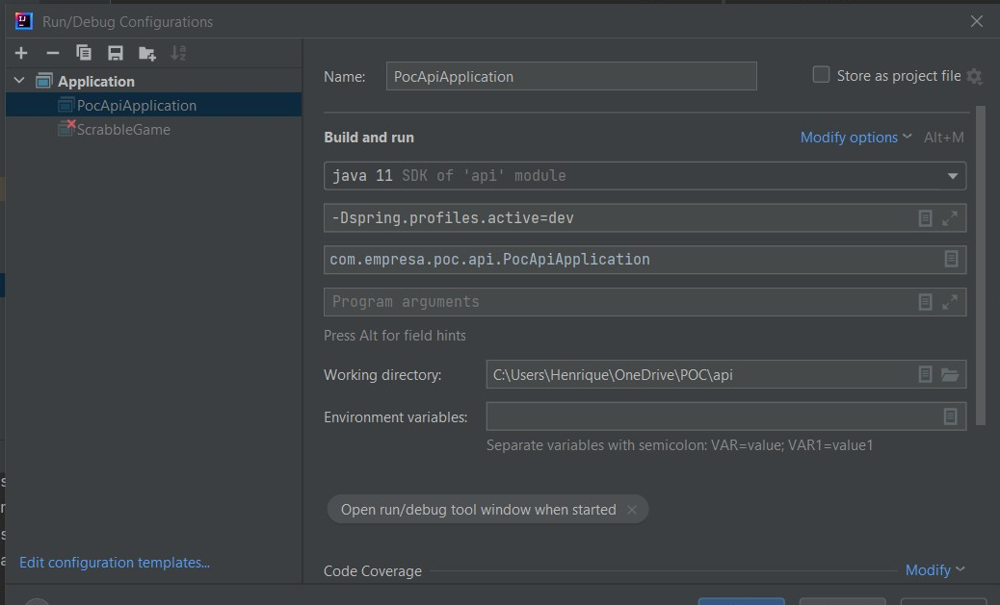

# POC-API

## Postgres

```
spring.datasource.url=jdbc:postgresql://localhost:5432/poc
spring.datasource.username=postgres
spring.datasource.password=

spring.jpa.show-sql=true

spring.jpa.properties.hibernate.dialect = org.hibernate.dialect.PostgreSQLDialect

spring.jpa.hibernate.ddl-auto = update
```

## SQL

```
select * from medico;
select * from paciente;
select * from remedio;
```

## Initial config


## Passos para nova entidade

### Classes
_Não esquecer que começa com letra maiúscula_

```
|_ Remedio
|_ RemedioDto
|_ RemedioController
|_ RemedioService
|_ RemedioRepository
```

### Annotations

```
Remedio
|_ Remedio @Entity... @GeneratedValue...
|_ RemedioDto
|_ RemedioController @RestController @RequestMapping @GetMapping
|_ RemedioService @Service
|_ RemedioRepository @Repository
```

### Lembretes

```
Remedio
|_ Remedio Construtures públicos, getters and setters
|_ RemedioDto Construtures públicos, getters and setters
|_ RemedioController Injetar a serviçe
|_ RemedioService Injetar a repository
|_ RemedioRepository Repository não é classe, é interface, extends CRUDRepository<Remedio, Integer>
```

### Configuracoes para rodar o postgresql local

```
-Dspring.profiles.active=dev
```




### Trabalhando com tags

## Tag leve

```
git tag v1.0.0 && git push origin v1.0.0
```

### Versioning

## Semantic Versioning 

- MAJOR version when you make incompatible API changes,
- MINOR version when you add functionality in a backwards compatible manner, and
- PATCH version when you make backwards compatible bug fixes.

Example:

`MAJOR.MINOR.PATCH`